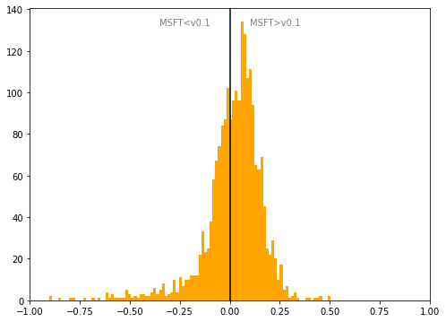

# Austria
## Available data EUBUCCO / MSFT

| Dimension    | EUBUCCO v0.1 | MSFT | Ratio |
| -------- | ------- | ------- | ------- |
|Total Footprint Area|867,271,697|887,166,041|98%|
|Total Footprint Number|4,135,733|3,716,419|111%|

## Statistics

### City-level difference EUBUCCO/MSFT 
 

## Regional breakdown
## Maps
## Outliers
## Known issues
## Recommendations
