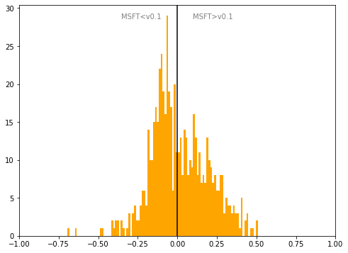

# Belgium
## Available data EUBUCCO / MSFT

| Dimension    | EUBUCCO v0.1 | MSFT | Ratio |
| -------- | ------- | ------- | ------- |
|Total Footprint Area|1,096,372,592|1,029,752,363|106%|
|Total Footprint Number|8,634,500|4,551,557|190%|

## Statistics

### City-level difference EUBUCCO/MSFT 
 

## Regional breakdown
## Maps
## Outliers
## Known issues
## Recommendations
