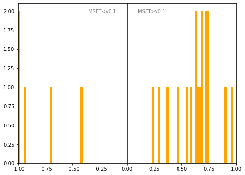

# Bulgaria
## Available data EUBUCCO / MSFT

| Dimension    | EUBUCCO v0.1 | MSFT | Ratio |
| -------- | ------- | ------- | ------- |
|Total Footprint Area|145,130,155|520,148,315|28%|
|Total Footprint Number|448,470|4,024,801|11%|

## Statistics

### City-level difference EUBUCCO/MSFT 
 

## Regional breakdown

| Region         |   Diff. MSFT/v0.1 |
|:---------------|------------------:|
| Blagoevgrad    |              3.79 |
| Burgas         |              2.19 |
| Dobrich        |              2.78 |
| Gabrovo        |              1.88 |
| Grad Sofiya    |              0.3  |
| Haskovo        |              2.97 |
| Kardzhali      |              2.69 |
| Kyustendil     |              5.68 |
| Lovech         |              3.94 |
| Montana        |              6.61 |
| Pazardzhik     |              5.33 |
| Pernik         |              3.33 |
| Pleven         |              6.37 |
| Plovdiv        |              2.49 |
| Razgrad        |              7.36 |
| Ruse           |              2.08 |
| Shumen         |              3.17 |
| Silistra       |             12.04 |
| Sliven         |              3.71 |
| Smolyan        |              3.44 |
| Sofia          |              2.67 |
| Stara Zagora   |              1.72 |
| Targovishte    |              0.23 |
| Varna          |              1.96 |
| Veliko Tarnovo |              4.19 |
| Vidin          |              3.83 |
| Vratsa         |              5.88 |
| Yambol         |              3.6  |

## Maps
## Outliers
## Known issues

### Issue (replace) 

#### Description

#### Possible cause

#### Significance 

#### Potential identification/cleaning strategy

#### Number of occurences

#### Example
## Recommendations
