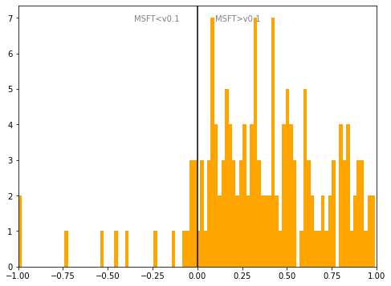

# Croatia
## Available data EUBUCCO / MSFT

| Dimension    | EUBUCCO v0.1 | MSFT | Ratio |
| -------- | ------- | ------- | ------- |
|Total Footprint Area|147,590,430|362,276,963|41%|
|Total Footprint Number|873,080|2,802,172|31%|

## Statistics

### City-level difference EUBUCCO/MSFT 
 

## Regional breakdown

| Region                 |   Diff. MSFT/v0.1 |
|:-----------------------|------------------:|
| Bjelovarska-Bilogorska |              8.83 |
| Brodsko-Posavska       |              4.81 |
| Dubrovacko-Neretvanska |              0.66 |
| Grad Zagreb            |              0.3  |
| Istarska               |              0.77 |
| Karlovacka             |              1.66 |
| Koprivničko-Križevačka |             15.31 |
| Krapinsko-Zagorska     |              6.7  |
| Licko-Senjska          |              3.03 |
| Medimurska             |              2.13 |
| Osjecko-Baranjska      |              2.78 |
| Požeško-Slavonska      |              3.43 |
| Primorsko-Goranska     |              1.09 |
| Sisacko-Moslavacka     |              0.31 |
| Splitsko-Dalmatinska   |              0.52 |
| Varaždinska            |              4.03 |
| Viroviticko-Podravska  |             11.65 |
| Vukovarsko-Srijemska   |              8.7  |
| Zadarska               |              1.29 |
| Zagrebačka             |              1.02 |
| Šibensko-Kninska       |              1.24 |

## Maps
## Outliers
## Known issues
## Recommendations
