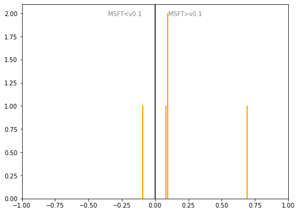

# Cyprus
## Available data EUBUCCO / MSFT

| Dimension    | EUBUCCO v0.1 | MSFT | Ratio |
| -------- | ------- | ------- | ------- |
|Total Footprint Area|74,417,048|90,582,552|82%|
|Total Footprint Number|467,594|523,628|89%|

## Statistics

### City-level difference EUBUCCO/MSFT 
 

## Regional breakdown
## Maps
## Outliers
## Known issues
## Recommendations
