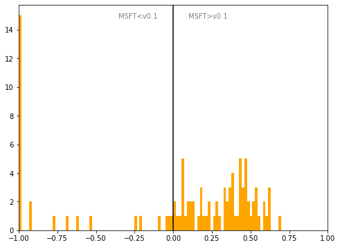

# Czechia
## Available data EUBUCCO / MSFT

| Dimension    | EUBUCCO v0.1 | MSFT | Ratio |
| -------- | ------- | ------- | ------- |
|Total Footprint Area|673,376,186|644,036,600|105%|
|Total Footprint Number|4,044,659|3,395,989|119%|

## Statistics

### City-level difference EUBUCCO/MSFT 
 

## Regional breakdown

| Region          |   Diff. MSFT/v0.1 |
|:----------------|------------------:|
| Jihomoravský    |             -0.59 |
| Jihočeský       |              0.45 |
| Karlovarský     |              0.33 |
| Kraj Vysočina   |              0.21 |
| Královéhradecký |              0.49 |
| Liberecký       |              0.33 |
| Moravskoslezský |             -0.89 |
| Olomoucký       |             -0.83 |
| Pardubický      |             -0.07 |
| Plzeňský        |              0.49 |
| Prague          |              0.03 |
| Středočeský     |              0.41 |
| Zlínský         |             -1    |
| Ústecký         |              0.33 |

## Maps
## Outliers
## Known issues

### Issue (replace) 

#### Description

#### Possible cause

#### Significance 

#### Potential identification/cleaning strategy

#### Number of occurences

#### Example
## Recommendations
