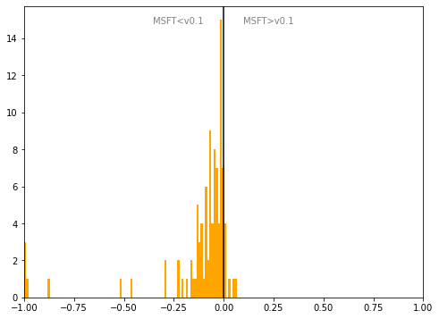

# Denmark
## Available data EUBUCCO / MSFT

| Dimension    | EUBUCCO v0.1 | MSFT | Ratio |
| -------- | ------- | ------- | ------- |
|Total Footprint Area|738,533,831|664,565,936|111%|
|Total Footprint Number|5,691,756|3,543,133|161%|

## Statistics

### City-level difference EUBUCCO/MSFT 
 

## Regional breakdown

| Region      |   Diff. MSFT/v0.1 |
|:------------|------------------:|
| Hovedstaden |             -0.09 |
| Midtjylland |             -0.09 |
| Nordjylland |             -0.11 |
| Sjælland    |             -0.04 |
| Syddanmark  |             -0.15 |

## Maps
## Outliers
## Known issues
## Recommendations
