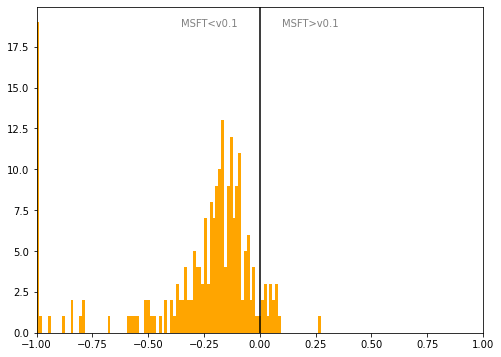

# Estonia
## Available data EUBUCCO / MSFT

| Dimension    | EUBUCCO v0.1 | MSFT | Ratio |
| -------- | ------- | ------- | ------- |
|Total Footprint Area|132,899,346|79,987,213|166%|
|Total Footprint Number|803,218|736,103|109%|

## Statistics

### City-level difference EUBUCCO/MSFT 
 

## Regional breakdown
## Maps
## Outliers
## Known issues
## Recommendations
