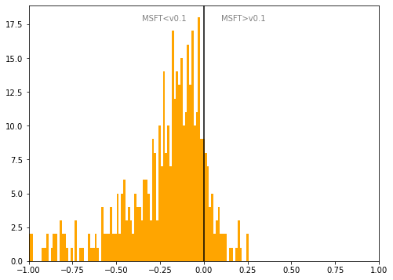

# Finland
## Available data EUBUCCO / MSFT

| Dimension    | EUBUCCO v0.1 | MSFT | Ratio |
| -------- | ------- | ------- | ------- |
|Total Footprint Area|691,145,893|581,220,225|119%|
|Total Footprint Number|5,370,223|4,512,188|119%|

## Statistics

### City-level difference EUBUCCO/MSFT 
 

## Regional breakdown
## Maps
## Outliers
## Known issues
## Recommendations
