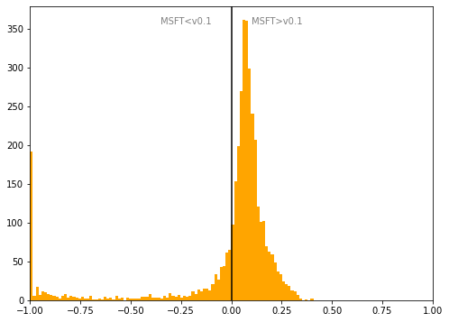

# France
## Available data EUBUCCO / MSFT

| Dimension    | EUBUCCO v0.1 | MSFT | Ratio |
| -------- | ------- | ------- | ------- |
|Total Footprint Area|5,851,128,662|5,712,136,467|102%|
|Total Footprint Number|47,847,462|25,856,614|185%|

## Statistics

### City-level difference EUBUCCO/MSFT 
 

## Regional breakdown

| Region                     |   Diff. MSFT/v0.1 |
|:---------------------------|------------------:|
| Auvergne-Rhône-Alpes       |              0.05 |
| Bourgogne-Franche-Comté    |             -0.01 |
| Bretagne                   |             -0.02 |
| Centre-Val de Loire        |              0.05 |
| Corse                      |             -0.35 |
| Grand Est                  |             -0.02 |
| Hauts-de-France            |             -0.14 |
| Normandie                  |             -0.25 |
| Nouvelle-Aquitaine         |             -0.02 |
| Occitanie                  |              0    |
| Pays de la Loire           |              0.02 |
| Provence-Alpes-Côte d'Azur |             -0.04 |
| Île-de-France              |              0.04 |

## Maps
## Outliers
## Known issues
## Recommendations
