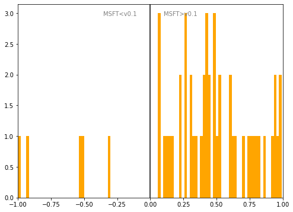

# Hungary
## Available data EUBUCCO / MSFT

| Dimension    | EUBUCCO v0.1 | MSFT | Ratio |
| -------- | ------- | ------- | ------- |
|Total Footprint Area|337,332,876|805,640,296|42%|
|Total Footprint Number|1,546,359|5,680,332|27%|

## Statistics

### City-level difference EUBUCCO/MSFT 
 

## Regional breakdown

| Region                 |   Diff. MSFT/v0.1 |
|:-----------------------|------------------:|
| Baranya                |              1.61 |
| Borsod-Abaúj-Zemplén   |              2.32 |
| Budapest               |              0.31 |
| Bács-Kiskun            |              3.1  |
| Békés                  |              4.83 |
| Csongrád               |              1.91 |
| Fejér                  |              0.79 |
| Gyor-Moson-Sopron      |              1.01 |
| Hajdú-Bihar            |              1.77 |
| Heves                  |              2.07 |
| Jász-Nagykun-Szolnok   |              3.36 |
| Komárom-Esztergom      |              0.8  |
| Nógrád                 |              1.23 |
| Pest                   |              1.06 |
| Somogy                 |              2.19 |
| Szabolcs-Szatmár-Bereg |              3.01 |
| Tolna                  |              2.29 |
| Vas                    |              0.46 |
| Veszprém               |              0.54 |
| Zala                   |              1.18 |

## Maps
## Outliers
## Known issues

### Issue (replace) 

#### Description

#### Possible cause

#### Significance 

#### Potential identification/cleaning strategy

#### Number of occurences

#### Example
## Recommendations
