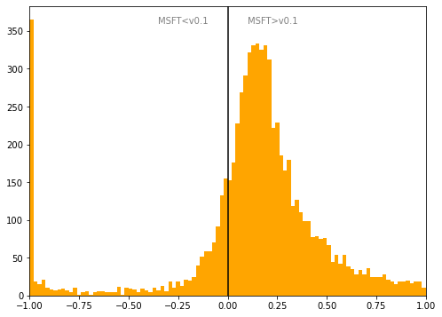

# Italy
## Available data EUBUCCO / MSFT

| Dimension    | EUBUCCO v0.1 | MSFT | Ratio |
| -------- | ------- | ------- | ------- |
|Total Footprint Area|3,668,104,390|4,642,410,260|79%|
|Total Footprint Number|20,674,153|15,560,014|133%|

## Statistics

### City-level difference EUBUCCO/MSFT 
 

## Regional breakdown

| Region                |   Diff. MSFT/v0.1 |
|:----------------------|------------------:|
| Abruzzo               |              0.53 |
| Apulia                |             -0.21 |
| Basilicata            |              0.04 |
| Calabria              |             -0.2  |
| Campania              |              1.75 |
| Emilia-Romagna        |              0.08 |
| Friuli-Venezia Giulia |             -0.26 |
| Lazio                 |              0.65 |
| Liguria               |              0.21 |
| Lombardia             |              0.14 |
| Marche                |              1.49 |
| Molise                |              1.52 |
| Piemonte              |              0.14 |
| Sardegna              |              0.71 |
| Sicily                |              1.05 |
| Toscana               |              0.33 |
| Trentino-Alto Adige   |              0.05 |
| Umbria                |              1.31 |
| Valle d'Aosta         |              0.28 |
| Veneto                |             -0.07 |

## Maps
## Outliers
## Known issues
## Recommendations
