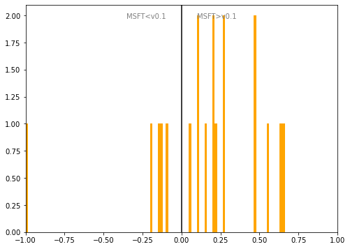

# Latvia
## Available data EUBUCCO / MSFT

| Dimension    | EUBUCCO v0.1 | MSFT | Ratio |
| -------- | ------- | ------- | ------- |
|Total Footprint Area|112,759,248|148,383,860|76%|
|Total Footprint Number|513,316|1,230,167|42%|

## Statistics

### City-level difference EUBUCCO/MSFT 
 

## Regional breakdown

| Region   |   Diff. MSFT/v0.1 |
|:---------|------------------:|
| Kurzeme  |              0.02 |
| Latgale  |              1.04 |
| Riga     |              0.17 |
| Vidzeme  |              0.15 |
| Zemgale  |              0.79 |

## Maps
## Outliers
## Known issues

### Issue (replace) 

#### Description

#### Possible cause

#### Significance 

#### Potential identification/cleaning strategy

#### Number of occurences

#### Example
## Recommendations
