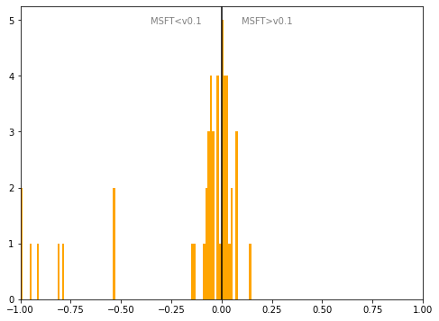

# Lithuania
## Available data EUBUCCO / MSFT

| Dimension    | EUBUCCO v0.1 | MSFT | Ratio |
| -------- | ------- | ------- | ------- |
|Total Footprint Area|290,400,677|270,047,694|108%|
|Total Footprint Number|1,924,431|2,156,828|89%|

## Statistics

### City-level difference EUBUCCO/MSFT 
 

## Regional breakdown

| Region       |   Diff. MSFT/v0.1 |
|:-------------|------------------:|
| Alytaus      |             -0.02 |
| Kauno        |              0.04 |
| Klaipedos    |             -0.17 |
| Marijampoles |             -0    |
| Panevezio    |             -0.02 |
| Taurages     |              0.03 |
| Telšiai      |             -0.89 |
| Utenos       |             -0.08 |
| Vilniaus     |              0.04 |
| Šiauliai     |             -0.1  |

## Maps
## Outliers
## Known issues

### Issue (replace) 

#### Description

#### Possible cause

#### Significance 

#### Potential identification/cleaning strategy

#### Number of occurences

#### Example
## Recommendations
