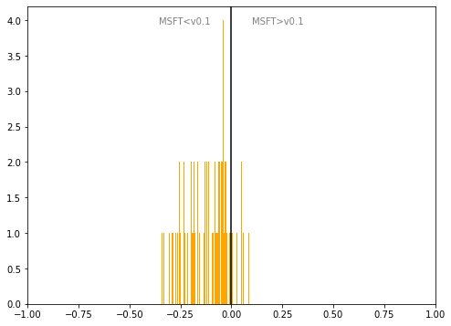

# Malta
## Available data EUBUCCO / MSFT

| Dimension    | EUBUCCO v0.1 | MSFT | Ratio |
| -------- | ------- | ------- | ------- |
|Total Footprint Area|32,599,347|29,216,603|112%|
|Total Footprint Number|142,616|74,215|192%|

## Statistics

### City-level difference EUBUCCO/MSFT 
 

## Regional breakdown

| Region     |   Diff. MSFT/v0.1 |
|:-----------|------------------:|
| Għawdex    |             -0.2  |
| Nofsinhar  |             -0.09 |
| Tramuntana |             -0.09 |
| Xlokk      |             -0.14 |
| Ċentrali   |             -0.04 |

## Maps
## Outliers
## Known issues
## Recommendations
