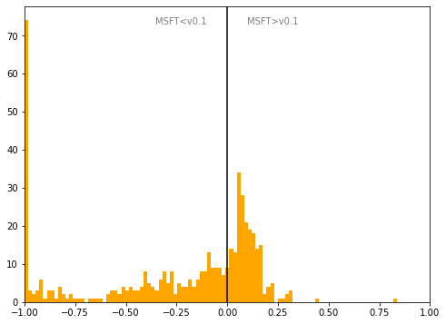

# Netherlands
## Available data EUBUCCO / MSFT

| Dimension    | EUBUCCO v0.1 | MSFT | Ratio |
| -------- | ------- | ------- | ------- |
|Total Footprint Area|1,202,665,089|892,132,826|135%|
|Total Footprint Number|9,692,657|3,723,191|260%|

## Statistics

### City-level difference EUBUCCO/MSFT 
 

## Regional breakdown

| Region        |   Diff. MSFT/v0.1 |
|:--------------|------------------:|
| Drenthe       |             -0.19 |
| Flevoland     |             -0.6  |
| Friesland     |              0.04 |
| Gelderland    |             -0.11 |
| Groningen     |              0.03 |
| Limburg       |             -0.03 |
| Noord-Brabant |             -0.07 |
| Noord-Holland |             -0.27 |
| Overijssel    |             -0.38 |
| Utrecht       |             -0.48 |
| Zeeland       |             -0.3  |
| Zuid-Holland  |             -0.64 |

## Maps
## Outliers
## Known issues

### Issue (replace) 

#### Description

#### Possible cause

#### Significance 

#### Potential identification/cleaning strategy

#### Number of occurences

#### Example
## Recommendations
