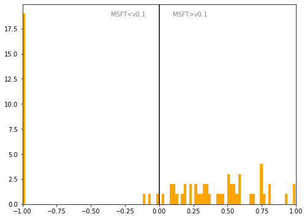

# Portugal
## Available data EUBUCCO / MSFT

| Dimension    | EUBUCCO v0.1 | MSFT | Ratio |
| -------- | ------- | ------- | ------- |
|Total Footprint Area|325,743,275|1,036,639,759|31%|
|Total Footprint Number|1,215,018|5,777,672|21%|

## Statistics

### City-level difference EUBUCCO/MSFT 
 

## Regional breakdown

| Region           |   Diff. MSFT/v0.1 |
|:-----------------|------------------:|
| Aveiro           |              3.46 |
| Azores           |             -1    |
| Beja             |              0.33 |
| Braga            |              4.07 |
| Bragança         |              3.71 |
| Castelo Branco   |              4.31 |
| Coimbra          |              4.77 |
| Faro             |              1.83 |
| Guarda           |              2.65 |
| Leiria           |              3.14 |
| Lisboa           |              0.88 |
| Madeira          |              1.08 |
| Portalegre       |              2.86 |
| Porto            |              2.38 |
| Santarém         |              3.67 |
| Setúbal          |              1.22 |
| Viana do Castelo |              4.44 |
| Vila Real        |              4.59 |
| Viseu            |              5.23 |
| Évora            |              1.1  |

## Maps
## Outliers
## Known issues
## Recommendations
