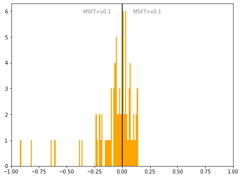

# Slovakia
## Available data EUBUCCO / MSFT

| Dimension    | EUBUCCO v0.1 | MSFT | Ratio |
| -------- | ------- | ------- | ------- |
|Total Footprint Area|428,026,555|407,197,751|105%|
|Total Footprint Number|3,488,125|2,503,510|139%|

## Statistics

### City-level difference EUBUCCO/MSFT 
 

## Regional breakdown

| Region          |   Diff. MSFT/v0.1 |
|:----------------|------------------:|
| Banskobystrický |             -0.35 |
| Bratislavský    |             -0.03 |
| Košický         |              0.02 |
| Nitriansky      |              0.03 |
| Prešovský       |              0.04 |
| Trenčiansky     |             -0.08 |
| Trnavský        |              0.07 |
| Žilinský        |             -0.09 |

## Maps
## Outliers
## Known issues
## Recommendations
