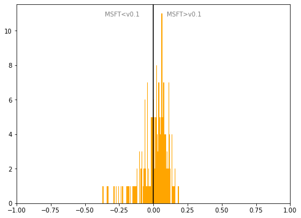

# Slovenia
## Available data EUBUCCO / MSFT

| Dimension    | EUBUCCO v0.1 | MSFT | Ratio |
| -------- | ------- | ------- | ------- |
|Total Footprint Area|182,617,285|187,586,082|97%|
|Total Footprint Number|1,162,832|1,111,940|105%|

## Statistics

### City-level difference EUBUCCO/MSFT 
 

## Regional breakdown

| Region                |   Diff. MSFT/v0.1 |
|:----------------------|------------------:|
| Gorenjska             |              0    |
| Goriška               |              0.01 |
| Jugovzhodna Slovenija |              0.06 |
| Koroška               |             -0.2  |
| Notranjsko-kraška     |              0.04 |
| Obalno-kraška         |              0.07 |
| Osrednjeslovenska     |              0.05 |
| Podravska             |              0.06 |
| Pomurska              |              0.06 |
| Savinjska             |             -0.01 |
| Spodnjeposavska       |              0.02 |
| Zasavska              |             -0.12 |

## Maps
## Outliers
## Known issues

### Issue (replace) 

#### Description

#### Possible cause

#### Significance 

#### Potential identification/cleaning strategy

#### Number of occurences

#### Example
## Recommendations
