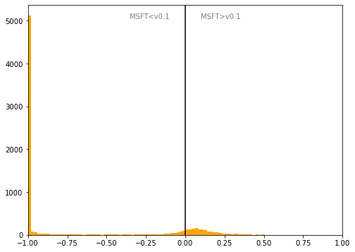

# Spain
## Available data EUBUCCO / MSFT

| Dimension    | EUBUCCO v0.1 | MSFT | Ratio |
| -------- | ------- | ------- | ------- |
|Total Footprint Area|2,979,509,619|1,382,051,126|216%|
|Total Footprint Number|16,340,067|4,724,328|346%|

## Statistics

### City-level difference EUBUCCO/MSFT 
 

## Regional breakdown

| Region                     |   Diff. MSFT/v0.1 |
|:---------------------------|------------------:|
| Andalucía                  |             -0.8  |
| Aragón                     |             -0.68 |
| Cantabria                  |             -0.54 |
| Castilla y León            |             -0.65 |
| Castilla-La Mancha         |             -0.35 |
| Cataluña                   |             -0.45 |
| Ceuta y Melilla            |             -0.02 |
| Comunidad Foral de Navarra |            inf    |
| Comunidad Valenciana       |             -0.9  |
| Comunidad de Madrid        |             -0.64 |
| Extremadura                |             -0.84 |
| Galicia                    |             -0.12 |
| Islas Baleares             |             -0.09 |
| Islas Canarias             |             -0.6  |
| La Rioja                   |             -0.55 |
| País Vasco                 |            inf    |
| Principado de Asturias     |              0.34 |
| Región de Murcia           |             -0.36 |

## Maps
## Outliers
## Known issues
## Recommendations
