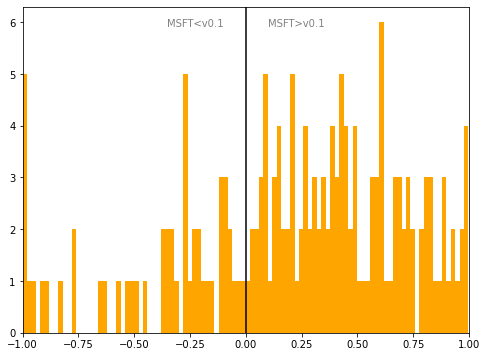

# Sweden
## Available data EUBUCCO / MSFT

| Dimension    | EUBUCCO v0.1 | MSFT | Ratio |
| -------- | ------- | ------- | ------- |
|Total Footprint Area|568,473,803|821,962,817|69%|
|Total Footprint Number|2,532,313|6,465,890|39%|

## Statistics

### City-level difference EUBUCCO/MSFT 
 

## Regional breakdown

| Region          |   Diff. MSFT/v0.1 |
|:----------------|------------------:|
| Blekinge        |              2.09 |
| Dalarna         |              1.11 |
| Gotland         |              1.19 |
| Gävleborg       |              0.64 |
| Halland         |              1.16 |
| Jämtland        |              0.72 |
| Jönköping       |              1.5  |
| Kalmar          |              1.02 |
| Kronoberg       |              0.92 |
| Norrbotten      |              1.08 |
| Orebro          |              0.39 |
| Skåne           |              0.25 |
| Stockholm       |             -0.3  |
| Södermanland    |              0.37 |
| Uppsala         |             -0.01 |
| Värmland        |              0.41 |
| Västerbotten    |              0.16 |
| Västernorrland  |              0.5  |
| Västmanland     |              1.09 |
| Västra Götaland |              0.44 |
| Östergötland    |              0.62 |

## Maps
## Outliers
## Known issues

### Issue (replace) 

#### Description

#### Possible cause

#### Significance 

#### Potential identification/cleaning strategy

#### Number of occurences

#### Example
## Recommendations
