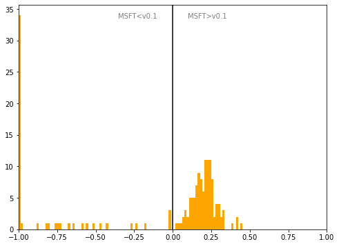

# Switzerland
## Available data EUBUCCO / MSFT

| Dimension    | EUBUCCO v0.1 | MSFT | Ratio |
| -------- | ------- | ------- | ------- |
|Total Footprint Area|506,395,304|479,141,154|106%|
|Total Footprint Number|2,641,571|1,829,013|144%|

## Statistics

### City-level difference EUBUCCO/MSFT 
 

## Regional breakdown

| Region                 |   Diff. MSFT/v0.1 |
|:-----------------------|------------------:|
| Aargau                 |             -0.02 |
| Appenzell Ausserrhoden |              0.2  |
| Appenzell Innerrhoden  |              0.27 |
| Basel-Landschaft       |             -1    |
| Basel-Stadt            |             -1    |
| Bern                   |             -0.27 |
| Fribourg               |              0.28 |
| Genève                 |              0.12 |
| Glarus                 |              0.12 |
| Graubünden             |              0.05 |
| Jura                   |             -1    |
| Lucerne                |              0.03 |
| Neuchâtel              |             -0.35 |
| Nidwalden              |             -0.24 |
| Obwalden               |             -0.99 |
| Sankt Gallen           |              0.2  |
| Schaffhausen           |              0.16 |
| Schwyz                 |              0.21 |
| Solothurn              |             -0.93 |
| Thurgau                |              0.21 |
| Ticino                 |             -0.01 |
| Uri                    |             -0.97 |
| Valais                 |              0.19 |
| Vaud                   |              0.19 |
| Zug                    |              0.16 |
| Zürich                 |              0.16 |

## Maps
## Outliers
## Known issues
## Recommendations
